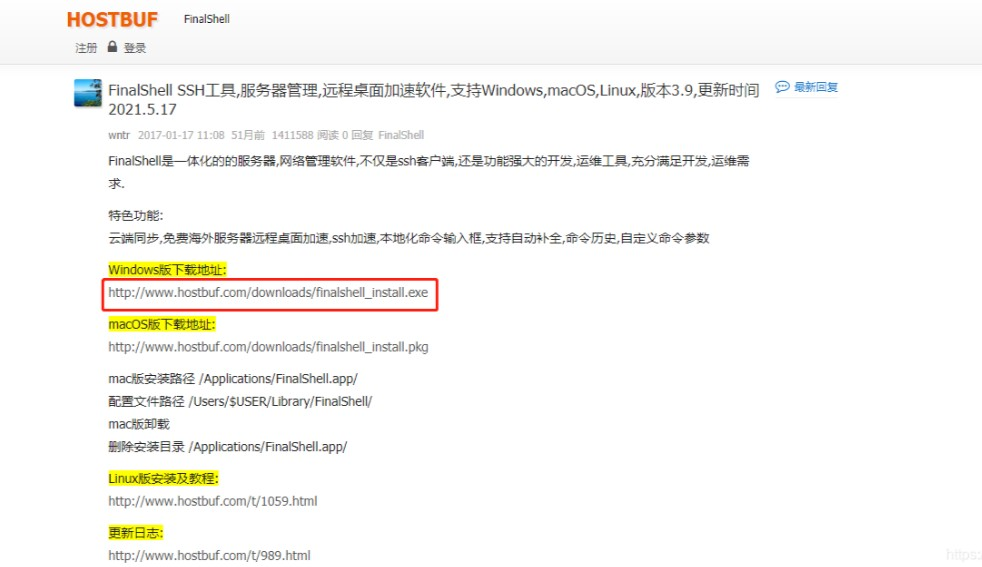
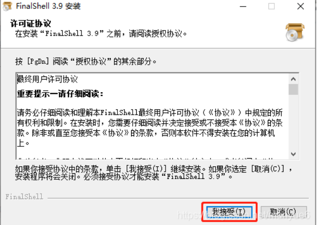

# FinalShell 安装与使用指南

---

## 目录
- [一、下载与安装](#一下载与安装)
  - [1. 下载地址](#1-下载地址)
  - [2. 安装步骤](#2-安装步骤（Windows 示例）)
- [二、使用教程](#二使用教程)
  - [1. 查询 Linux IP 地址](#1-查询-linux-ip-地址)
  - [2. 连接 Linux 服务器](#2-连接-linux-服务器)
- [注意事项](#注意事项)

---

## 一、下载与安装

### 1. 下载地址
- 官网下载：[FinalShell](http://www.hostbuf.com/t/988.html)
- 根据系统选择对应版本（Windows/Linux/macOS）。

---

### 2. 安装步骤（Windows 示例）
1. **双击安装包**  
   运行下载的 `FinalShell.exe` 文件。
   
2. **同意许可协议**  
   点击 `我接受(I)`。
  
3. **进入安装向导**  
   点击 `下一步`。
   
4. **选择安装目录**  
   默认路径或自定义路径，点击 `安装`。
5. **完成安装**  
   - 依次点击：`确定` → `Next` → `I Agree` → `Install` → `Finish` → `关闭`。
   - 出现「安装成功」提示即完成。

---

## 二、使用教程

### 1. 查询 Linux IP 地址
在 Linux 终端执行以下命令：ifconfig

### 2.FinalShell  连接 Linux 

