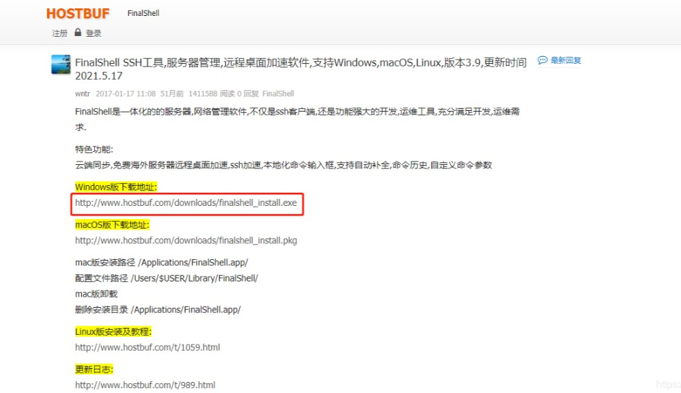

# 项目演示

## 1. 项目截图

## 2. 相关链接
- [项目文档](../Day1_TestFundamentals/Test_Theory.md)
- <a href="https://youtu.be/abc123" target="_blank">观看完整演示视频</a>

## 3. 视频演示
<iframe width="560" height="315" src="https://www.bilibili.com/video/BV1bg411V7pp?vd_source=e72e2fe7e39c9513f5f87765d3cc7937&spm_id_from=333.788.videopod.episodes&p=89" frameborder="0" allowfullscreen></iframe>
- <a href="https://www.bilibili.com/video/BV1bg411V7pp?vd_source=e72e2fe7e39c9513f5f87765d3cc7937&spm_id_from=333.788.videopod.episodes&p=89" target="_blank">观看完整演示视频</a>

https://github.com/dzm75277229/Testing-notes/blob/main/Video/%E8%A7%86%E9%A2%91.mp4
## 4. 项目运行视频

<iframe 
  width="560" 
  height="315" 
  src="https://www.youtube.com/embed/视频ID?autoplay=1&mute=1" 
  frameborder="0" 
  allow="accelerometer; autoplay; encrypted-media; gyroscope; picture-in-picture" 
  allowfullscreen>
</iframe>
<iframe 
  width="100%" 
  height="500" 
  src="//player.bilibili.com/player.html?aid=视频AID&page=1&autoplay=true" 
  scrolling="no" 
  border="0" 
  frameborder="no" 
  framespacing="0" 
  allowfullscreen="true">
</iframe>
# 项目演示视频

## 自动播放的视频（静音）
<video controls autoplay muted width="100%">
  <source src="../../Video/视频.mp4" type="video/mp4">
  您的浏览器不支持视频标签。
</video>

## 手动播放的视频（带声音）
<video controls width="100%">
  <source src="../../Video/视频.mp4" type="video/mp4">
</video>
# FinalShell 安装与使用指南

---

## 目录
- [一、下载与安装](#一下载与安装)
  - [1. 下载地址](#1-下载地址)
  - [2. 安装步骤](#2-安装步骤)
- [二、使用教程](#二使用教程)
  - [1. 查询 Linux IP 地址](#1-查询-linux-ip-地址)
  - [2. 连接 Linux 服务器](#2-连接-linux-服务器)
- [注意事项](#注意事项)

---

## 一、下载与安装

### 1. 下载地址
- 官网下载：[FinalShell](http://www.hostbuf.com/t/988.html)
- 根据系统选择对应版本（Windows/Linux/macOS）。

---

### 2. 安装步骤（Windows 示例）
1. **双击安装包**  
   运行下载的 `FinalShell.exe` 文件。
   
2. **同意许可协议**  
   点击 `我接受(I)`。
  
3. **进入安装向导**  
   点击 `下一步`。
   
4. **选择安装目录**  
   默认路径或自定义路径，点击 `安装`。
5. **完成安装**  
   - 依次点击：`确定` → `Next` → `I Agree` → `Install` → `Finish` → `关闭`。
   - 出现「安装成功」提示即完成。

---

## 二、使用教程

### 1. 查询 Linux IP 地址
在 Linux 终端执行以下命令：ifconfig

### 2.FinalShell  连接 Linux 

